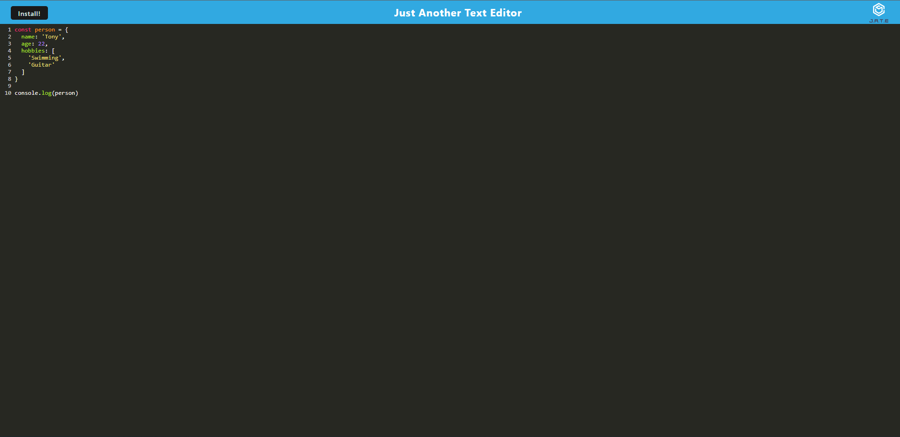

# HW-15-TextEditor
A text editor progressive web application.

## Table of Contents
- [Introduction](#introduction)
- [Application Preview](#application-preview)
- [Tech Stack](#tech-stack)

## Introduction
A simple text editor that is downloadable and readily available offline. This is achieved by the use of IndexedDB API, which stores and retrieves data in the client side as JSON objects. This app is also backwards compatible with the use of Babel, a transpiler, and is able to run on older JavaScript engines. Webpack was also utilized to bundle the modularized code into a single page application.

## Application Preview
The app is deployed on [heroku.](https://tony-pwa-jate.herokuapp.com/)

## Tech Stack
Technologies used includes:
1. Nodejs
2. Webpack
3. Babel
4. Workbox
5. IndexedDB
